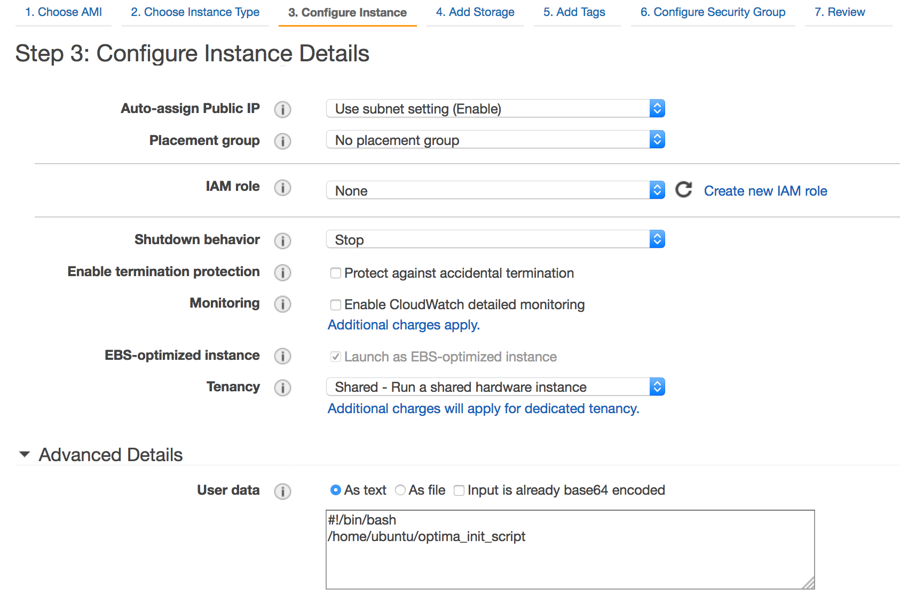
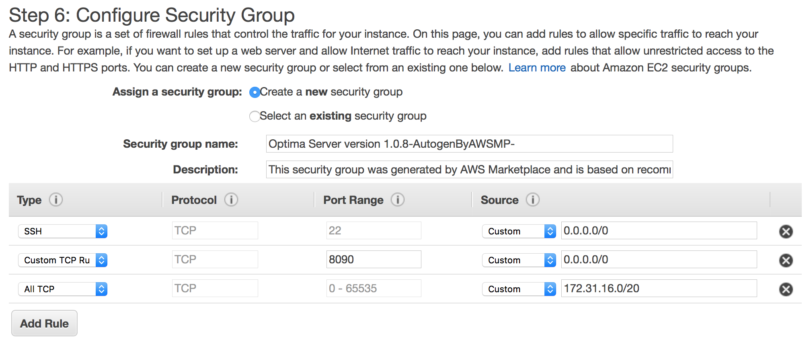

# Deploying Optima via the AWS Marketplace

The following instructions walks you through the deployment of an Optima server via the AWS Marketplace. The Optima AMI is free to use and limited to 20 containers and up to 5 docker hosts.

## Deploying the Optima server

### Prerequisites:
 * You have access to an AWS account.

### Deploying Optima in AWS

From the Optima listing page on the [AWS Marketplace](https://aws.amazon.com/marketplace/pp/xxxxxxxxxx):
 1. Select the **Manual Launch** tab.
 1. Click on the **Accept Software Terms** button.
 1. Click on the **Launch with the EC2 Console** for a selected AWS region of your choice

Then, follow the following default AWS EC2 launch steps starting from step 2:

**Step 2: Choose Instance type**
 * Minimum recommended Instance type: c4.xlarge (minimum 4 CPU and 7.5 MB memory)

**Step 3: Configure Instance Details**

 1. Pick the **VPC** and **subnet** where you want to deploy the Optima server.

 1. Enable "**Auto-assign Public IP**". You will SSH into the Optima server to run the Optima CLI.

 1. Expand the "**Advanced Details**" section

 1. Enter the following 2 lines in the "**User data**" field
   ```
   #!/bin/bash
   /home/ubuntu/optima_init_script
   ```
   * This step is required to configure Optima automatically when the EC2 instance is launched.
   * If you omitted this step, please deploy a new EC2 instance based on the Optima AWS AMI.
   * The following screenshot shows where these 2 lines are entered:
    <p align="center">
    <table><tr><td>
    
    </td></tr></table>
    </p>

**Step 4: Add Storage**
   * Accept default settings.

**Step 5: Configure Security Group**
   * Accept default settings.

**Step 6: Configure Security Group**

* You need to add the following additional security rule to the default security group generated by AWS Marketplace for the Optima server:

| Type    | Protocol | Port Range | Source                            |
| ------- | ---------| ---------- |---------------------------------- |
| All TCP | TCP      | 0-65535    | Custom: `CIDR_OF_SELECTED_SUBNET` |

* Replace `CIDR_OF_SELECTED_SUBNET` with the actual CIDR of the subnet you selected in Step 3 (see above). Follow these steps to find it:

  1. Open a separate tab in your web browser and go to: https://console.aws.amazon.com/vpc

  1. Click **Subnet** (on the left bar) to see the list of subnets in the region where you are deploying the Optima server.

  1. Click the subnet you selected in Step 3.b.

  1. Copy the **IPv4 CIDR** value and paste it into the **_Source_** field for the new security rule you are adding.

   * The following screenshot shows all the security rules required for Optima server to be deployed and used, including the last one you just added manually:
  <p align="center">
  <table><tr><td>
  
  </td></tr></table>
  </p>

Lastly, click on "**Review and Launch**" to accept the default settings set in the following screens...


## Deploying a Docker cloud in AWS
Optima's free edition allows you to control a Docker cloud with up to 5 Docker hosts. The following instructions explain how to deploy a single Docker host. You can repeat the same steps on multiple VMs to deploy more than one Docker host.

### Prerequisites:
 * You own an AWS account
 * **Networking**:
   * The Optima server must be able to reach the Docker hosts over IP.
 * **Firewall** (a.k.a. security groups):
   * Optima communicates to each Docker host via the Docker Remote API, which port (4342 or 2575 or custom) must be open on each Docker host.

### Creating and configuring a Docker host in AWS:
  1. Create an AWS EC2 instance (any flavor) based on a standard Ubuntu 14.04 LTS AWS AMI.
  1. The associated AWS Security group must allow TCP connections to port 4243 from Optima's IP address.
  1. Select an SSH key to be able to SSH to this new instance (after your click "Launch" on the review page).
  1. From your favorite terminal, SSH to this instance using the appropriate private SSH key:
  1. Download the provided [docker-host-install.sh](scripts/docker-host-install.sh) bash script to this VM:
     ```
     $ wget https://github.com/MosaixSoft/optima-staging/blob/master/scripts/docker-host-install.sh
     ```

  1. Run the docker-host-install script:
     ```
     $ ./docker-host-install.sh
     ```

     This bash script does the following:
        * Installs docker (version 17.03.1-ce)
        * Activates Docker Remote API
        * Generates a unique ID for the Docker engine

  Repeat from step 1 for each docker host you want to deploy.

**Take note of the IP address for each Docker host deployed**, as it will be used later to connect the Optima server to these docker hosts. Use an IP address which can be reached over IP by the Optima server. If you are deploying your Docker hosts in the same VPC/subnet as the Optima server, you can use the private IP address of the docker hosts, otherwise use the public IP address provided by AWS for these EC2 instances.

## Installing Optima Client CLI
After deploying your Optima server and Docker cloud, you want to install the [Optima CLI](../README.md#optima-cli) to a system from where you want to run Optima commands from. You may use a separate VM (or EC2 instance) which can reach the Optima server over IP.

Alternatively you can use the [Optima REST API](../README.md#optima-restful-apis) to manage your services. We suggest using the CLI as it is easier than using the REST calls and we include here instructions to install the CLI.

**Prerequisites**:
* Ubuntu 14.04 (recommended) or any Linux OS

**Follow these steps**:

* From your Ubuntu 14.04 LTS virtual machine, download and install the Optima CLI:

  ```
  $ wget https://s3-us-west-1.amazonaws.com/optima-distribution/Optima+1.0.4/cli-4.0.7.tar.gz
  $ tar -xzvf cli-4.0.4.tar.gz
  $ cd optima-cli
  $ ./install.sh
  ```

## Activate Optima
Follow the instruction in [here](activation.md) to activate Optima.


## Mounting the Docker cloud:
This section includes instructions to mount the Docker cloud using the installed CLI and to verify that the cloud is mounted and ready to be used.
The IP address of the Optima server (*<optima_host_ip>*) must be accessible from the system where the Optima CLI is installed. Port 8090 must be open on the Optima server.

   In addition, the Optima server must be able to reach the Docker hosts over IP. Optima communicates to each Docker host via the Docker Remote API which port (4342 or 2575 or custom) must be open on each Docker host that will be connected to Optima.

### Connect Optima to your Docker cloud:

1. **Identify the IP address of each host member of your Docker cloud**

   You want to make sure those IP addresses are reachable from the Optima server. If Optima is not deployed in the same subnet/network as your Docker hosts, you want to use the public IP address of each Docker host as the endpoints.

1. **Create the following _cloud.yaml_ file:**

   ```yaml
   cloud:
      # name of the mounted cloud
      name: cloud1
      provider: docker
      # username and password of the machine where optima is running
      # The username must have the sudo privileges
      username: mosaix
      password: mosaix
      # docker hosts (up to 5)
      endpoints: http://<docker-host-ip1>:4243/, http://<docker-host-ip2>:4243/, http://<docker-host-ip3>:4243/, http://<docker-host-ip4>:4243/, http://<docker-host-ip5>:4243/
      # CPU and memory overcommit ratios
      cpuovercommit: 2    # (Default 1)
      memoryovercommit: 2 # (Default 1)
   ```

   You can add up to 5 endpoints in this trial version, which correspond to the IP address of each Docker host.
   The *cpuovercommit* and *memoryovercommit* are ratios set to define the maximum number of resources (CPU, memory) Optima is allowed to allocate per host, relative to actual amount of resources available on each host (quota = overcommit x actual).

1. **Connect Optima to your Docker cloud**:

   Using Optima CLI:

   ```
   $ optima target
   IP address []: <optima-host-ip>
   Port number [8090]:
   Target was set successfully to <optima-host-ip>:8090
   ```
 1. **Mount the docker hosts as a cloud**:

    ```
    $ optima cloud mount cloud.yaml
    ```
 1. **Verify the mount was successful**:

    Run the following command:
    ```
    $ optima cloud status
    ```
    You should obtain the an output that is similart to the following:
    ```
    {
       "CPUOverCommit": 2,
       "MemoryOverCommit": 2,
       "Name": "my-cloud",
       "Networks": [
           "host",
           "bridge",
           "none"
       ],
       "NumberOfHosts": 5,
       "Provider": "DOCKER",
       "Status": "Discovered"
    }
    ```
    Note that the output shown previously is for a cloud that has 5 docker hosts. If few hosts were mounted, then the "NumberOfHosts" would have a value that is equal to the number of mounted docker hosts.

    To see a list of the mounted hosts and their resource capacity, run:
    ```
    $ optima host ls
    ```
    You should obtain the an output that is looks like:
    ```
    Host Name      Status    CPU    Memory    Disk    Cloud Name
    -------------  --------  -----  --------  ------  ------------
    host1  UP        0/2    0/1026    0/0     my-cloud
    host2  UP        0/2    0/1026    0/0     my-cloud
    host3  UP        0/2    0/1026    0/0     my-cloud
    host4  UP        0/2    0/1026    0/0     my-cloud
    host5  UP        0/2    0/1026    0/0     my-cloud
    ```
    Note that the output shown previously is for a cloud that has 5 docker hosts. If few hosts were mounted, then output would be slightly different depending on the number of docker hosts and the resource capacity of the VMs where docker was installed.

    Optima is now ready to be used with your Docker cloud! Follow the instructions in this [tutorial](../tutorial.md) to launch your first service, or check the commands in the 'Usage' section at [here](../README.md#usage) to launch services or inspect the hosts in your Docker cloud.
